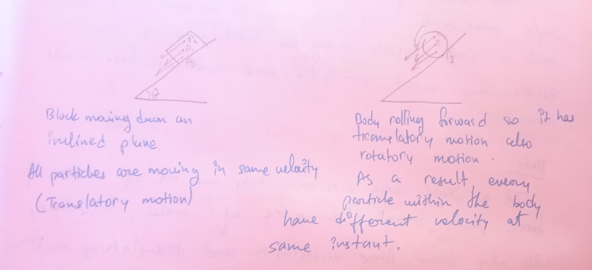

# System of Particles & Rotational Motion 

# Introduction 

## Some Important terms 

1. **Particle**: An object whose mass is finite but size and internal structure can be neglected. In Most cases the motion of large bodies can be described in terms of motion of a particle by considering them to be a rigid body where all particles move with a same velocity, i.e., have only translatory motion. 
2. **System**: A collection of very large number of particles which mutually interact with one another. A body of finite size can be regarded as a system because it is composed of large number of particle interacting with one another.
3. **Internal forces**: The mutual forces exerted by the particles of a system on one another is called internal force. This force is responsible for holding particles of system together.
4. **External forces**: The external agencies that can change the velocity of the object. 
